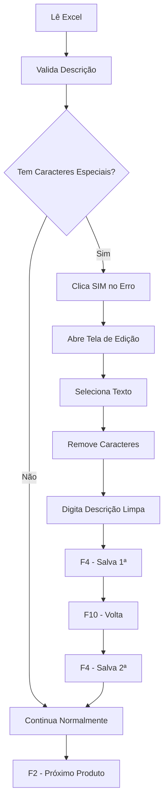

# 🧹 Limpeza Automática de Descrições de Famílias

## O que foi implementado

Um sistema automático que detecta e corrige **descrições de famílias com caracteres especiais** que causam erro no Consinco durante a execução da **Manutenção Mix Ativo**.

---

## 📋 Fluxo de Funcionamento

### Quando ocorre a limpeza

Quando o sistema identifica caracteres especiais na descrição durante a leitura do Excel:

```
❌ BANDEJA TRAMONTINA SMALL 91390/108  ← tem "/"
✅ BANDEJA TRAMONTINA SMALL 91390108   ← sem caracteres especiais
```

### Processo automático (passo a passo)

1. **Detecção** → Sistema valida se há caracteres especiais
2. **Clique SIM** → Responde automaticamente o popup de erro do Consinco
3. **Limpeza** → Abre a tela de edição e remove caracteres
4. **Salva (F4)** → Primeira vez
5. **Volta (F10)** → Retorna à tela anterior
6. **Salva (F4)** → Segunda vez (confirma)
7. **Próximo (F2)** → Continua para o próximo produto

---

## 🎯 Caracteres Removidos

O sistema remove automaticamente:

- `/` (barra)
- `,` (vírgula)
- `.` (ponto)
- `-` (hífen)
- `_` (underscore)
- `~` (til)
- `!` (exclamação)
- `@` (arroba)
- `#` (hashtag)
- `$` (cifrão)
- `%` (percentual)
- `&` (e comercial)
- `*` (asterisco)
- `(` `)` (parênteses)
- `+` (mais)
- `=` (igual)
- `[` `]` (colchetes)
- `{` `}` (chaves)
- `;` `:` (ponto-vírgula, dois-pontos)
- `<` `>` (menor/maior)
- `?` (interrogação)
- `|` `\` (barra vertical, barra invertida)
- `` ` `` (acento grave)
- `'` `"` (aspas)

**Também remove múltiplos espaços em branco**, deixando apenas um espaço entre palavras.

---

## 📂 Arquivos Criados

### `core/familia_cleaner.py`
Módulo principal com a classe `FamiliaDescriptionCleaner`:

- ✅ **Detecção de popup** de erro
- ✅ **Clique automático** no botão "SIM"
- ✅ **Limpeza de caracteres** especiais
- ✅ **Fluxo completo** de salvamento
- ✅ **Validação** de descrições

---

## 🔧 Modificações em `digitador_mix.py`

1. **Import do módulo**
   ```python
   from familia_cleaner import FamiliaDescriptionCleaner
   ```

2. **Inicialização** no `__init__`
   ```python
   self.familia_cleaner = FamiliaDescriptionCleaner()
   ```

3. **Detecção e limpeza** após F8
   ```python
   if desc_str and not self.familia_cleaner.validate_cleaned_description(desc_str):
       self.familia_cleaner.handle_error_flow(desc_str)
   ```

---

## 📊 Logs e Feedback

O sistema gera logs detalhados para debug:

```
[FamiliaCleanerINFO] Iniciando limpeza: 'BANDEJA TRAMONTINA SMALL 91390/108'
[FamiliaCleanerINFO] Clicando em SIM...
[FamiliaCleanerINFO] Selecionando todo o texto...
[FamiliaCleanerINFO] Descrição limpa: 'BANDEJA TRAMONTINA SMALL 91390108'
[FamiliaCleanerINFO] Salvando com F4...
[FamiliaCleanerINFO] Voltando com F10...
[FamiliaCleanerINFO] Salvando novamente com F4...
[FamiliaCleanerINFO] Limpeza concluída com sucesso!
```

Na interface do GAM você verá:
- ✅ `✓ Descrição 'XXXX' foi limpa automaticamente`
- ⚠️ `⚠ Falha ao limpar 'XXXX', continuando...`

---

## 🛠️ Como Usar

1. **Coloque o Excel com os produtos** em `bd_entrada/mix.xlsx`
2. **Execute a ação** "Manutenção Mix Ativo" normalmente
3. **Deixe o sistema trabalhar** - a limpeza acontece automaticamente

Nenhuma configuração adicional necessária! 🎉

---

## ⚙️ Detalhes Técnicos

### Detecção de Erro
- Procura por cores amarelas na tela (típica de aviso no Consinco)
- Usa OpenCV para análise de imagem
- Timeout padrão: 1.5 segundos

### Clique no Botão
- Estratégia 1: Detecta cor azul de botão
- Estratégia 2: Usa posição padrão como fallback
- Ambas têm retry automático

### Digitação de Texto
- Estratégia 1: **Clipboard + Ctrl+V** (mais confiável)
- Estratégia 2: `pyautogui.write()` (fallback)
- Intervalo de 0.02s entre caracteres

### Salvar em Cascata
- F4 → Salva na tela de edição
- F10 → Volta à tela anterior
- F4 → Salva na tela principal
- Tempo de espera: 1.0s entre cada operação

---

## 🐛 Troubleshooting

### "Clique em SIM não funcionou"
- Verifique se o popup aparece na tela
- O sistema fará retry automático
- Continua mesmo se falhar

### "Descrição não foi limpa"
- Verifique se a descrição tinha caracteres especiais
- Confira o log para mensagens de erro
- Tente calibrar o Mix novamente

### "Falha ao digitar texto"
- Sistema fará fallback para `pyautogui.write()`
- Verifique se o PowerShell está disponível (Windows)
- Tente usar descrições mais curtas

---

## 📝 Exemplos Reais

| Antes | Depois |
|-------|--------|
| BANDEJA TRAMONTINA SMALL 91390/108 | BANDEJA TRAMONTINA SMALL 91390108 |
| AÇÚCAR CRISTAL 1KG - DOCE LIFE | AÇÚCAR CRISTAL 1KG DOCE LIFE |
| CAFÉ 500g (PILAO) | CAFÉ 500g PILAO |
| LEITE LT - INTEGRAL [TIROL] | LEITE LT INTEGRAL TIROL |

---

## 🔄 Fluxo Completo Automático



---

## ✨ Benefícios

✅ **Automático** - Sem intervenção manual  
✅ **Inteligente** - Detecta apenas quando necessário  
✅ **Robusto** - Múltiplas estratégias de fallback  
✅ **Rastreável** - Logs detalhados de cada ação  
✅ **Integrado** - Funciona dentro do fluxo normal do Mix  
✅ **Seguro** - Não afeta produtos sem problemas  

---

## 📞 Suporte

Se tiver problemas:
1. Verifique os logs na interface do GAM
2. Confira se as coordenadas foram calibradas
3. Tente em modo debug (leia a saída do console)
4. Revise a descrição no Excel antes de enviar

---

**Última atualização:** 08/05/2026  
**Versão:** 1.0  
**Status:** ✅ Produção
